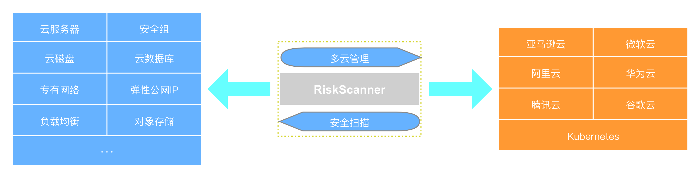

# 欢迎使用 RiskScanner

RiskScanner 是开源企业级公有云安全合规平台，公有云安全合规服务通过灵活多变的合规规则，对常见公有云平台（如AWS，Azure，Aliyun，Huawei，Tencent，K8s和GCP等）提供公有云资源的安全扫描，帮助企业有效提升公有云使用的合规性。

## 功能能力

RiskScanner 安全合规能力：

- 用于管理公共云帐户和资源的规则引擎。它允许用户定义策略以启用管理良好的云基础架构，既安全又优化成本。它将组织具有的许多脚本整合为一个轻量级且灵活的工具，并具有统一的指标和报告。
- 通过确保对安全策略（例如加密和访问要求），标签策略以及通过未使用资源的垃圾收集和非工作时间资源管理的成本管理的实时合规性，RiskScanner 可用于管理 AWS，Azure，Aliyun，Huawei，Tencent，K8s 和 GCP 等环境。
- 设置策略以简单的YAML配置文件编写，使用户能够指定关于资源类型（EC2，ELB，EBS，ASG，AMI，RDS，VPC，S3，ECS，OSS）的策略，并由过滤器和操作的词汇表构成。
- 它与每个供应商的云本机无服务器功能集成在一起，以通过内置配置实时实施策略。或者，它可以作为简单的 cron 作业在服务器上运行，以针对大型现有集群执行。

## 技术栈

- 后端: [Spring Boot](https://www.tutorialspoint.com/spring_boot/spring_boot_introduction.htm)
- 前端: [Vue.js](https://vuejs.org/)
- 数据库: [MySQL](https://www.mysql.com/)
- 基础设施: [Docker](https://www.docker.com/)

## 微信群

