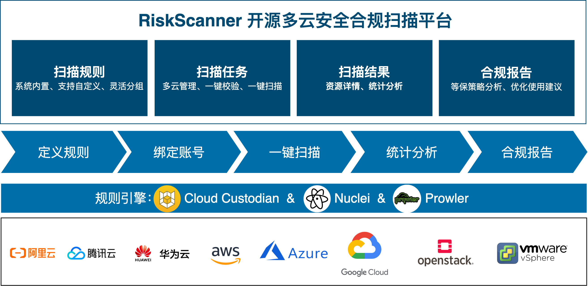

# 总体介绍

!!! tip ""

    RiskScanner 是开源的多云安全合规扫描平台，基于 Cloud Custodian 和 Nuclei 引擎，实现对主流公(私)有云资源的安全合规扫描和漏洞扫描。

    RiskScanner 遵循 GPL v2 开源协议，使用 SpringBoot/Vue 进行开发，界面美观、用户体验好。RiskScanner支持的公有云包括阿里云、腾讯云、华为云、Amazon Web Services、Microsoft Azure、Google Cloud，支持的私有云包括 OpenStack、VMware vSphere。

## 架构图

## 功能优势

!!! tip ""
    - 等保 2.0 预检：符合等保 2.0 规范，覆盖安全审计、访问控制、入侵防范、网络架构和管理中心等各项检查；
    - CIS 合规检查：符合 CIS 规范，检查和实时监控在云上的资源是否符合 CIS 要求；
    - 漏洞扫描：基于漏洞规则库，通过扫描等手段对指定的网络设备及应用服务的安全脆弱性进行检测；
    - 最佳实践建议：制定合规管控基线，为企业级用户提供最佳实践建议，持续提升合规水平；

## 技术优势

!!! tip ""
    - 规则简单灵活：扫描规则采用简单的 YAML 格式，简单易懂、并允许用户自定义规则；
    - 支持多公/私有云：支持的公有云包括阿里云、腾讯云、华为云、Amazon Web Services、Microsoft Azure、Google Cloud，支持的私有云包括 OpenStack、VMware vSphere 等；
    - 支持多资源类型：支持的资源类型包括云服务器、云磁盘、云数据库、负载均衡、对象存储、专有网络、安全组等；
    - 丰富全面的漏洞规则库：覆盖 OWASP TOP 10 的 Web 漏洞，例如：SQL 注入、跨站脚本攻击（XSS）、跨站请求伪造（CSRF）、弱密码等。

## 页面展示

