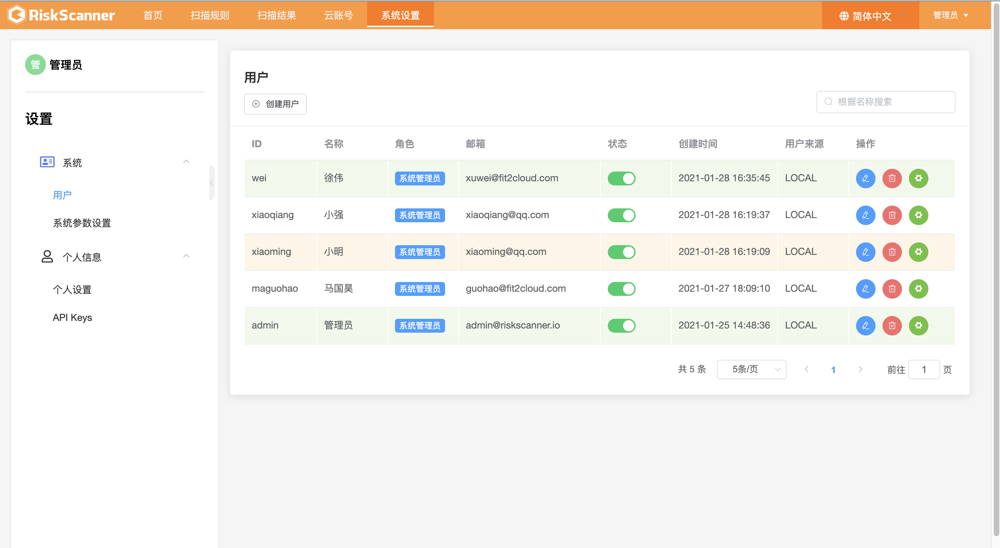

# 快速开始

## 准备工作
* 操作系统: CentOS 7.x
* CPU/内存: 4核16G
* 磁盘空间: 100G

#### 一、快速安装

```sh
curl -sSL https://github.com/RiskScanner/riskscanner/releases/latest/download/quick_start.sh | sh
```

#### 二、Release 安装
 获取 release 离线安装包(x.x.x 为版本号)
 
```sh
# 下载github release离线安装包
# 解压安装包
tar zxvf riskscanner-release-x.x.x-offline.tar.gz
# 进入解压包
cd riskscanner-release-x.x.x-offline
# 执行脚本
./install.sh
# 查看运行状态
rsctl status
```

#### 三、离线安装
 获取 OSS 离线安装包(x.x.x 为版本号)
 
```sh
# 获取OSS离线安装包
wget https://fit2cloud2-offline-installer.oss-cn-beijing.aliyuncs.com/riskscanner/riskscanner-release-x.x.x-offline.tar.gz
# 解压安装包
tar zxvf riskscanner-release-x.x.x-offline.tar.gz
# 进入解压包
cd riskscanner-release-x.x.x-offline
# 执行脚本
./install.sh
# 查看运行状态
rsctl status
```

#### 四、在线安装
 获取 OSS 在线安装包(x.x.x 为版本号)
 
```sh
# 获取OSS在线安装包
wget https://fit2cloud2-offline-installer.oss-cn-beijing.aliyuncs.com/riskscanner/riskscanner-release-x.x.x.tar.gz
# 解压安装包
tar zxvf riskscanner-release-x.x.x.tar.gz
# 进入解压包
cd riskscanner-release-x.x.x
# 执行脚本
./install.sh
# 查看运行状态
rsctl status
```

!!! info "安装完成之后 RiskScanner 会以名字为 `RiskScanner` 服务的形式存在会有如下命令"
    - rsctl  status    查看 RiskScanner 服务运行状态
    - rsctl  start     启动 RiskScanner 服务
    - rsctl  stop      停止 RiskScanner 服务
    - rsctl  restart   重启 RiskScanner 服务
    - rsctl  reload    重新加载 RiskScanner 服务
    - rsctl  uninstall 卸载 RiskScanner 服务
    - rsctl  version   查看 RiskScanner 版本信息
    
## 登录并使用

### 登录

#### Login 界面


安装成功后，通过浏览器访问如下页面登录 RiskScanner

```
地址: http://目标服务器IP地址:8080
用户名: admin
密码: riskscanner
```

### 界面说明

RiskScanner 公有云安全合规平台 UI 及交互遵循 Material Design 及 UI 规范，基于统一规范进行开发，提供一致的操作体验。

#### UI 主界面




