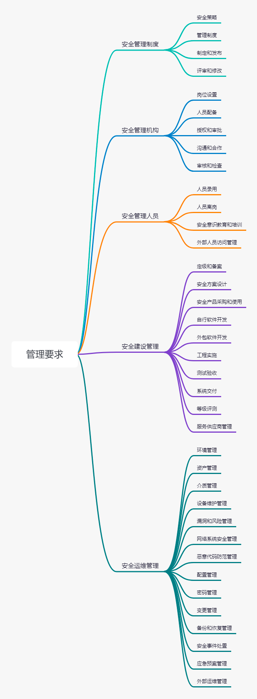

## 等级保护2.0

> 网络安全等级保护条例

| 标准号 | 类别 | 标准名称 | 文件名称 |
| :----: | :----: | :----: | :----: |
| GB 17859-1999	| 计算机信息系统	| 安全保护等级划分准则	| GB 17859-1999.pdf| 
| GB/T 22239-2019	| 信息安全技术	| 网络安全等级保护基本要求	| GBT 22239-2019.pdf| 
| GB/T 22240-2020	| 信息安全技术	| 网络安全等级保护定级指南	| GBT 22240-2020.pdf| 
| GB/T 25070-2019	| 信息安全技术	| 网络安全等级保护安全设计技术要求	| GBT 25070-2019.pdf| 
| GB/T 28448-2019	| 信息安全技术	| 网络安全等级保护测评要求	| GBT 28448-2019.pdf| 
| GB/T 28449-2018	| 信息安全技术	| 网络安全等级保护测评要求	| GBT 28449-2018.pdf| 
| GB/T 36958-2018	| 信息安全技术	| 网络安全等级保护安全管理中心技术要求	| GBT 36958-2018.pdf| 

### 主要标准的特点和变化

#### No.1 标准的主要特点
01. 将对象范围由原来的信息系统改为等级保护对象（信息系统、通信网络设施和数据资源等），对象包括网络基础设施（广电网、电信网、专用通信网络 等）、云计算平台/系统、大数据平台/系统、物联网、工业控制 系统、采用移动互联技术的系统等。

02. 在1.0标准的基础上进行了优化，同时针对云计算、移动互联、物联网、工业控制系统及大数据等新技术和新应用领域提出新要求，形成了安全通用要求+新应用安全扩展要求构成的标准要求内容。

03. 采用了“一个中心，三重防护”的防护理念和分类结构，强化了建立纵深防御和精细防御体系的思想。

04. 强化了密码技术和可信计算技术的使用，把可信验证列入各个级别并逐级提出各个环节的主要可信验证要求，强调通过密码技术、可信验证、安全审计和态势感知等建立主动防御体系的期望。

#### No.2 标准的主要变化
01. 名称由原来的《信息系统安全等级保护基本要求》改为《网络安全等级保护基本要求》。等级保护对象由原来的信息系统调整为基础信息网络、信息系统（含采用移动互联技术的系统）、云计算平台/系统、大数据应用/平台/资源、物联网和工业控制系统等。

02. 将原来各个级别的安全要求分为安全通用要求和安全扩展要求，其中安全扩展要求包括安全扩展要求云计算安全扩展要求、移动互联安全扩展要求、物联网安全扩展要求以及工业控制系统安全扩展要求。安全通用要求是不管等级保护对象形态如何必须满足的要求。

03. 基本要求中各级技术要求修订为“安全物理环境”、“安全通信网络”、“安全区域边界”、“安全计算环境”和“安全管理中心”；各级管理要求修订为“安全管理制度”、“安全管理机构”、“安全管理人员”、“安全建设管理”和“安全运维管理”。

04. 取消了原来安全控制点的S、A、G标注，增加一个附录A“关于安全通用要求和安全扩展要求的选择和使用”，描述等级保护对象的定级结果和安全要求之间的关系，说明如何根据定级的S、A结果选择安全要求的相关条款，简化了标准正文部分的内容。增加附录C描述等级保护安全框架和关键技术、增加附录D描述云计算应用场景、附录E描述移动互联应用场景、附录F描述物联网应用场景、附录G描述工业控制系统应用场景、附录H描述大数据应用场景。

### 主要标准的框架和内容
#### No.1 标准的框架结构
《GB/T 22239-2019》、《GB/T 25070-2019》和《GB/T28448-2019》三个标准采取了统一的框架结构。

安全通用要求细分为技术要求和管理要求。其中技术要求包括“安全物理环境”、“安全通信网络”、“安全区域边界”、“安全计算环境”和“安全管理中心”；管理要求包括“安全管理制度”、“安全管理机构”、“安全管理人员”、“安全建设管理”和“安全运维管理”。

#### No.2 安全通用要求
安全通用要求针对共性化保护需求提出，无论等级保护对象以何种形式出现，需要根据安全保护等级实现相应级别的安全通用要求。安全扩展要求针对个性化保护需求提出，等级保护对象需要根据安全保护等级、使用的特定技术或特定的应用场景实现安全扩展要求。等级保护对象的安全保护需要同时落实安全通用要求和安全扩展要求提出的措施。

01. 安全物理环境

针对物理机房提出的安全控制要求。主要对象为物理环境、物理设备和物理设施等；涉及的安全控制点包括物理位置的选择、物理访问控制、防盗窃和防破坏、防雷击、防火、防水和防潮、防静电、温湿度控制、电力供应和电磁防护。

02. 安全通信网络

针对通信网络提出的安全控制要求。主要对象为广域网、城域网和局域网等；涉及的安全控制点包括网络架构、通信传输和可信验证。

03. 安全区域边界

针对网络边界提出的安全控制要求。主要对象为系统边界和区域边界等；涉及的安全控制点包括边界防护、访问控制、入侵防范、恶意代码防范、安全审计和可信验证。

04. 安全计算环境

针对边界内部提出的安全控制要求。主要对象为边界内部的所有对象，包括网络设备、安全设备、服务器设备、终端设备、应用系统、数据对象和其他设备等；涉及的安全控制点包括身份鉴别、访问控制、安全审计、入侵防范、恶意代码防范、可信验证、数据完整性、数据保密性、数据备份与恢复、剩余信息保护和个人信息保护。

05. 安全管理中心

针对整个系统提出的安全管理方面的技术控制要求，通过技术手段实现集中管理；涉及的安全控制点包括系统管理、审计管理、安全管理和集中管控。

06. 安全管理制度

针对整个管理制度体系提出的安全控制要求，涉及的安全控制点包括安全策略、管理制度、制定和发布以及评审和修订。

07. 安全管理机构

针对整个管理组织架构提出的安全控制要求，涉及的安全控制点包括岗位设置、人员配备、授权和审批、沟通和合作以及审核和检查。

08. 安全管理人员

针对人员管理提出的安全控制要求，涉及的安全控制点包括人员录用、人员离岗、安全意识教育和培训以及外部人员访问管理。

09. 安全建设管理

针对安全建设过程提出的安全控制要求，涉及的安全控制点包括定级和备案、安全方案设计、安全产品采购和使用、自行软件开发、外包软件开发、工程实施、测试验收、系统交付、等级测评和服务供应商管理。

10. 安全运维管理

针对安全运维过程提出的安全控制要求，涉及的安全控制点包括环境管理、资产管理、介质管理、设备维护管理、漏洞和风险管理、网络和系统安全管理、恶意代码防范管理、配置管理、密码管理、变更管理、备份与恢复管理、安全事件处置、应急预案管理和外包运维管理。

#### No.3 安全扩展要求
安全扩展要求是采用特定技术或特定应用场景下的等级保护对象需要增加实现的安全要求。包括以下四方面：

01. 云计算安全扩展要求是针对云计算平台提出的安全通用要求之外额外需要实现的安全要求。主要内容包括“基础设施的位置”、“虚拟化安全保护”、“镜像和快照保护”、“云计算环境管理”和“云服务商选择”等。

02. 移动互联安全扩展要求是针对移动终端、移动应用和无线网络提出的安全要求，与安全通用要求一起构成针对采用移动互联技术的等级保护对象的完整安全要求。主要内容包括“无线接入点的物理位置”、“移动终端管控”、“移动应用管控”、“移动应用软件采购”和“移动应用软件开发”等。

03. 物联网安全扩展要求是针对感知层提出的特殊安全要求，与安全通用要求一起构成针对物联网的完整安全要求。主要内容包括“感知节点的物理防护”、“感知节点设备安全”、“网关节点设备安全”、“感知节点的管理”和“数据融合处理”等。

04. 工业控制系统安全扩展要求主要是针对现场控制层和现场设备层提出的特殊安全要求，它们与安全通用要求一起构成针对工业控制系统的完整安全要求。主要内容包括“室外控制设备防护”、“工业控制系统网络架构安全”、“拨号使用控制”、“无线使用控制”和“控制设备安全”等。

> 相关要求

> 等保要求

<table>
    <tr>
        <th  colspan="3">类别</th>
        <th  colspan="3">环境</th>
        <th  colspan="3">评测项</th>
        <th  colspan="3">说明</th>
        <th  colspan="3">一级</th>
        <th  colspan="3">二级</th>
        <th  colspan="3">三级</th>
        <th  colspan="3">四级</th>
    </tr>
    <tr>
        <td  colspan="3" rowspan="300"><h3>安全通用要求</h3></td>
        <td  colspan="3" rowspan="26"><h4>安全物理环境</h4></td>
        <td  colspan="3" rowspan="2"><h5>物理位置选择</h5></td>
        <td  colspan="3">机房场地应选择在具有防震、防风和防雨等能力的建筑内。</td>
        <td  colspan="3"></td>
        <td  colspan="3">√</td>
        <td  colspan="3">√</td>
        <td  colspan="3">√</td>
    </tr>
    <tr>
        <td  colspan="3">机房场地应选择在具有防震、防风和防雨等能力的建筑内。</td>
        <td  colspan="3"></td>
        <td  colspan="3">√</td>
        <td  colspan="3">√</td>
        <td  colspan="3">√</td>
    </tr>
    <tr>
        <td  colspan="3" rowspan="3"><h5>物理访问控制</h5></td>
        <td  colspan="3">机房出入口应安排专人值守或配置电子门禁系统，控制、鉴别和记录进入的人员。</td>
        <td  colspan="3">√</td>
        <td  colspan="3">√</td>
        <td  colspan="3"></td>
        <td  colspan="3"></td>
    </tr>
    <tr>
        <td  colspan="3">机房出入口应配置电子门禁系统，控制、鉴别和记录进入的人员。</td>
        <td  colspan="3"></td>
        <td  colspan="3"></td>
        <td  colspan="3">√</td>
        <td  colspan="3">√</td>
    </tr>
    <tr>
        <td  colspan="3">重要区域应配置第二道电子门禁系统，控制、鉴别和记录进入的人员。</td>
        <td  colspan="3"></td>
        <td  colspan="3"></td>
        <td  colspan="3"></td>
        <td  colspan="3">√</td>  
    </tr>
    <tr>
        <td  colspan="3" rowspan="3"><h5>防盗窃和防破坏</h5></td>
        <td  colspan="3">应将设备或主要部件进行固定，并设置明显的不易除去的标识。</td>
        <td  colspan="3">√</td>
        <td  colspan="3">√</td>
        <td  colspan="3">√</td>
        <td  colspan="3">√</td>
    </tr>
    <tr>
        <td  colspan="3">应将通信线缆铺设在隐蔽安全处。</td>
        <td  colspan="3"></td>
        <td  colspan="3">√</td>
        <td  colspan="3">√</td>
        <td  colspan="3">√</td>
    </tr>
    <tr>
        <td  colspan="3">应设置机房防盗报警系统或设置有专人值守的视频监控系统。</td>
        <td  colspan="3"></td>
        <td  colspan="3"></td>
        <td  colspan="3">√</td>
        <td  colspan="3">√</td>  
    </tr>
    <tr>
        <td  colspan="3" rowspan="2"><h5>防雷击</h5></td>
        <td  colspan="3">应将各类机柜、设施和设备等通过接地系统安全接地。</td>
        <td  colspan="3">√</td>
        <td  colspan="3">√</td>
        <td  colspan="3">√</td>
        <td  colspan="3">√</td>
    </tr>
    <tr>
        <td  colspan="3">应采取措施防止感应雷，例如设置防雷保安器或过压保护装置等。</td>
        <td  colspan="3"></td>
        <td  colspan="3"></td>
        <td  colspan="3">√</td>
        <td  colspan="3">√</td>
    </tr>
    <tr>
        <td  colspan="3" rowspan="4"><h5>防火</h5></td>
        <td  colspan="3">机房应设置灭火设备。</td>
        <td  colspan="3">√</td>
        <td  colspan="3"></td>
        <td  colspan="3"></td>
        <td  colspan="3"></td>
    </tr>
    <tr>
        <td  colspan="3">机房应设置火灾自动消防系统，能够自动检测火情、自动报警，并自动灭火。</td>
        <td  colspan="3"></td>
        <td  colspan="3">√</td>
        <td  colspan="3">√</td>
        <td  colspan="3">√</td>
    </tr>
    <tr>
        <td  colspan="3">机房及相关的工作房间和辅助房应采用具有耐火等级的建筑材料。</td>
        <td  colspan="3"></td>
        <td  colspan="3">√</td>
        <td  colspan="3">√</td>
        <td  colspan="3">√</td>
    </tr>
    <tr>
        <td  colspan="3">应对机房划分区域进行管理，区域和区域之间设置隔离防火措施。</td>
        <td  colspan="3"></td>
        <td  colspan="3"></td>
        <td  colspan="3">√</td>
        <td  colspan="3">√</td>
    </tr>
    <tr>
        <td  colspan="3" rowspan="3"><h5>防水和防潮</h5></td>
        <td  colspan="3">应采取措施防止雨水通过机房窗户、屋顶和墙壁渗透。</td>
        <td  colspan="3">√</td>
        <td  colspan="3">√</td>
        <td  colspan="3">√</td>
        <td  colspan="3">√</td>
    </tr>
    <tr>
        <td  colspan="3">应采取措施防止机房内水蒸气结露和地下积水的转移与渗透。</td>
        <td  colspan="3"></td>
        <td  colspan="3">√</td>
        <td  colspan="3">√</td>
        <td  colspan="3">√</td>
    </tr>
    <tr>
        <td  colspan="3">应安装对水敏感的检测仪表或元件，对机房进行防水检测和报警。</td>
        <td  colspan="3"></td>
        <td  colspan="3"></td>
        <td  colspan="3">√</td>
        <td  colspan="3">√</td>
    </tr>
    <tr>
        <td  colspan="3" rowspan="2"><h5>防静电</h5></td>
        <td  colspan="3">应采用防静电地板或地面并采用必要的接地防静电措施。</td>
        <td  colspan="3"></td>
        <td  colspan="3">√</td>
        <td  colspan="3">√</td>
        <td  colspan="3">√</td>
    </tr>
    <tr>
        <td  colspan="3">应采取措施防止静电的产生，例如釆用静电消除器、佩戴防静电手环等。</td>
        <td  colspan="3"></td>
        <td  colspan="3"></td>
        <td  colspan="3">√</td>
        <td  colspan="3">√</td>
    </tr>
    <tr>
        <td  colspan="3" rowspan="1"><h5>温湿度控制</h5></td>
        <td  colspan="3">应设置必要的温湿度调节设施，使机房温湿度的变化在设备运行所允许的范围之内。</td>
        <td  colspan="3">√</td>
        <td  colspan="3">√</td>
        <td  colspan="3">√</td>
        <td  colspan="3">√</td>
    </tr>
    <tr>
        <td  colspan="3" rowspan="4"><h5>电力供应</h5></td>
        <td  colspan="3">应在机房供电线路上配置稳压器和过电压防护设备。</td>
        <td  colspan="3">√</td>
        <td  colspan="3">√</td>
        <td  colspan="3">√</td>
        <td  colspan="3">√</td>
    </tr>
    <tr>
        <td  colspan="3">应提供短期的备用电力供应，至少满足设备在断电情况下的正常运行要求。</td>
        <td  colspan="3"></td>
        <td  colspan="3">√</td>
        <td  colspan="3">√</td>
        <td  colspan="3">√</td>
    </tr>
    <tr>
        <td  colspan="3">应设置冗余或并行的电力电缆线路为计算机系统供电。</td>
        <td  colspan="3"></td>
        <td  colspan="3"></td>
        <td  colspan="3">√</td>
        <td  colspan="3">√</td>
    </tr>
    <tr>
        <td  colspan="3">应提供应急供电设备。</td>
        <td  colspan="3"></td>
        <td  colspan="3"></td>
        <td  colspan="3"></td>
        <td  colspan="3">√</td>
    </tr>
    <tr>
        <td  colspan="3" rowspan="2"><h5>电磁防护</h5></td>
        <td  colspan="3">电源线和通信线缆应隔离铺设，避免互相干扰。</td>
        <td  colspan="3"></td>
        <td  colspan="3">√</td>
        <td  colspan="3">√</td>
        <td  colspan="3">√</td>
    </tr>
    <tr>
        <td  colspan="3">应对关键设备或关键区域实施电磁屏蔽。</td>
        <td  colspan="3"></td>
        <td  colspan="3"></td>
        <td  colspan="3">√</td>
        <td  colspan="3">√</td>
    </tr>
    <tr>
        <td  colspan="3" rowspan="15"><h4>安全通信网络</h4></td>
        <td  colspan="3" rowspan="6"><h5>网络架构</h5></td>
        <td  colspan="3">应保证网络设备的业务处理能力满足业务高峰期需要。</td>
        <td  colspan="3"></td>
        <td  colspan="3"></td>
        <td  colspan="3">√</td>
        <td  colspan="3">√</td>
    </tr>
    <tr>
        <td  colspan="3">应保证网络各个部分的带宽满足业务高峰期需要。</td>
        <td  colspan="3"></td>
        <td  colspan="3"></td>
        <td  colspan="3">√</td>
        <td  colspan="3">√</td>
    </tr>
    <tr>
        <td  colspan="3">应划分不同的网络区域，并按照方便管理和控制的原则为各网络区域分配地址。</td>
        <td  colspan="3"></td>
        <td  colspan="3">√</td>
        <td  colspan="3">√</td>
        <td  colspan="3">√</td>
    </tr>
    <tr>
        <td  colspan="3">应避免将重要网络区域部署在边界处，重要网络区域与其他网络区域之间应釆取可靠的技术隔离手段。</td>
        <td  colspan="3"></td>
        <td  colspan="3">√</td>
        <td  colspan="3">√</td>
        <td  colspan="3">√</td>
    </tr>
    <tr>
        <td  colspan="3">应提供通信线路、关键网络设备和关键计算设备的硬件冗余，保证系统的可用性。</td>
        <td  colspan="3"></td>
        <td  colspan="3"></td>
        <td  colspan="3">√</td>
        <td  colspan="3">√</td>
    </tr>
    <tr>
        <td  colspan="3">应按照业务服务的重要程度分配带宽，优先保障重要业务。</td>
        <td  colspan="3"></td>
        <td  colspan="3"></td>
        <td  colspan="3"></td>
        <td  colspan="3">√</td>
    </tr>
    <tr>
        <td  colspan="3" rowspan="5"><h5>通信传输</h5></td>
        <td  colspan="3">应采用校验技术保证通信过程中数据的完整性。</td>
        <td  colspan="3">√</td>
        <td  colspan="3"></td>
        <td  colspan="3"></td>
        <td  colspan="3"></td>
    </tr>
    <tr>
        <td  colspan="3">应采用校验技术或密码技术保证通信过程中数据的完整性。</td>
        <td  colspan="3"></td>
        <td  colspan="3">√</td>
        <td  colspan="3">√</td>
        <td  colspan="3">√</td>
    </tr>
    <tr>
        <td  colspan="3">应釆用密码技术保证通信过程中数据的保密性。</td>
        <td  colspan="3"></td>
        <td  colspan="3"></td>
        <td  colspan="3">√</td>
        <td  colspan="3">√</td>
    </tr>
    <tr>
        <td  colspan="3">应在通信前基于密码技术对通信的双方进行验证或认证。</td>
        <td  colspan="3"></td>
        <td  colspan="3"></td>
        <td  colspan="3"></td>
        <td  colspan="3">√</td>
    </tr>
    <tr>
        <td  colspan="3">应基于硬件密码模块对重要通信过程进行密码运算和密钥管理。</td>
        <td  colspan="3"></td>
        <td  colspan="3"></td>
        <td  colspan="3"></td>
        <td  colspan="3">√</td>
    </tr>
    <tr>
        <td  colspan="3" rowspan="4"><h5>可信验证</h5></td>
        <td  colspan="3">可基于可信根对通信设备的系统引导程序、系统程序等进行可信验证，并在检测到其可信性受到破坏后进行报警。</td>
        <td  colspan="3">√</td>
        <td  colspan="3"></td>
        <td  colspan="3"></td>
        <td  colspan="3"></td>
    </tr>
    <tr>
        <td  colspan="3">可基于可信根对通信设备的系统引导程序、系统程序、重要配置参数和通信应用程序等进行可信验证，并在检测到其可信性受到破坏后进行报警,并将验证结果形成审计记录送至安全管理中心。</td>
        <td  colspan="3"></td>
        <td  colspan="3">√</td>
        <td  colspan="3"></td>
        <td  colspan="3"></td>
    </tr>
    <tr>
        <td  colspan="3">可基于可信根对通信设备的系统引导程序、系统程序、重要配置参数和通信应用程序等进行可信验证，并在应用程序的关键执行环节进行动态可信验证，在检测到其可信性受到破坏后进行报警，并将验证结果形成审计记录送至安全管理中心。</td>
        <td  colspan="3"></td>
        <td  colspan="3"></td>
        <td  colspan="3">√</td>
        <td  colspan="3"></td>
    </tr>
    <tr>
        <td  colspan="3">可基于可信根对通信设备的系统引导程序、系统程序、重要配置参数和通信应用程序等进行可信验证，并在应用程序的所有执行环节进行动态可信验证，在检测到其可信性受到破坏后进行报警，并将验证结果形成审计记录送至安全管理中心，并进行动态关联感知。</td>
        <td  colspan="3"></td>
        <td  colspan="3"></td>
        <td  colspan="3"></td>
        <td  colspan="3">√</td>
    </tr>
    <tr>
        <td  colspan="3" rowspan="27"><h4>安全区域边界</h4></td>
        <td  colspan="3" rowspan="6"><h5>边界防护</h5></td>
        <td  colspan="3">应保证跨越边界的访问和数据流通过边界设备提供的受控接口进行通信。</td>
        <td  colspan="3">√</td>
        <td  colspan="3">√</td>
        <td  colspan="3">√</td>
        <td  colspan="3">√</td>
    </tr>
    <tr>
        <td  colspan="3">应能够对非授权设备私自联到内部网络的行为进行检査或限制。</td>
        <td  colspan="3"></td>
        <td  colspan="3"></td>
        <td  colspan="3">√</td>
        <td  colspan="3">√</td>
    </tr>
    <tr>
        <td  colspan="3">应能够对内部用户非授权联到外部网络的行为进行检查或限制。</td>
        <td  colspan="3"></td>
        <td  colspan="3"></td>
        <td  colspan="3">√</td>
        <td  colspan="3">√</td>
    </tr>
    <tr>
        <td  colspan="3">应限制无线网络的使用，保证无线网络通过受控的边界设备接入内部网络。</td>
        <td  colspan="3"></td>
        <td  colspan="3"></td>
        <td  colspan="3">√</td>
        <td  colspan="3">√</td>
    </tr>
    <tr>
        <td  colspan="3">应能够在发现非授权设备私自联到内部网络的行为或内部用户非授权联到外部的行为时，对其进行有效阻断。</td>
        <td  colspan="3"></td>
        <td  colspan="3"></td>
        <td  colspan="3"></td>
        <td  colspan="3">√</td>
    </tr>
    <tr>
        <td  colspan="3">应采用可信验证机制对接入到网络中的设备进行可信验证，保证接入网络的设备真实可信。</td>
        <td  colspan="3"></td>
        <td  colspan="3"></td>
        <td  colspan="3"></td>
        <td  colspan="3">√</td>
    </tr>
    <tr>
        <td  colspan="3" rowspan="6"><h5>访问控制</h5></td>
        <td  colspan="3">应在网络边界根据访问控制策略设置访问控制规则，默认情况下除允许通信外受控接口拒绝所有通信。</td>
        <td  colspan="3">√</td>
        <td  colspan="3">√</td>
        <td  colspan="3">√</td>
        <td  colspan="3">√</td>
    </tr>
    <tr>
        <td  colspan="3">应删除多余或无效的访问控制规则，优化访问控制列表，并保证访问控制规则数量最小化。</td>
        <td  colspan="3">√</td>
        <td  colspan="3">√</td>
        <td  colspan="3">√</td>
        <td  colspan="3">√</td>
    </tr>
    <tr>
        <td  colspan="3">应对源地址、目的地址、源端口、目的端口和协议等进行检査，以允许/拒绝数据包进出。</td>
        <td  colspan="3">√</td>
        <td  colspan="3">√</td>
        <td  colspan="3">√</td>
        <td  colspan="3">√</td>
    </tr>
    <tr>
        <td  colspan="3">应能根据会话状态信息为进出数据流提供明确的允许/拒绝访问的能力。</td>
        <td  colspan="3"></td>
        <td  colspan="3">√</td>
        <td  colspan="3">√</td>
        <td  colspan="3">√</td>
    </tr>
    <tr>
        <td  colspan="3">应对进出网络的数据流实现基于应用协议和应用内容的访问控制。</td>
        <td  colspan="3"></td>
        <td  colspan="3"></td>
        <td  colspan="3">√</td>
        <td  colspan="3"></td>
    </tr>
    <tr>
        <td  colspan="3">应在网络边界通过通信协议转换或通信协议隔离等方式进行数据交换。</td>
        <td  colspan="3"></td>
        <td  colspan="3"></td>
        <td  colspan="3"></td>
        <td  colspan="3">√</td>
    </tr>
    <tr>
        <td  colspan="3" rowspan="5"><h5>入侵防范</h5></td>
        <td  colspan="3">应在关键网络节点处监视网络攻击行为。</td>
        <td  colspan="3"></td>
        <td  colspan="3">√</td>
        <td  colspan="3"></td>
        <td  colspan="3"></td>
    </tr>
    <tr>
        <td  colspan="3">应在关键网络节点处检测、防止或限制从外部发起的网络攻击行为。</td>
        <td  colspan="3"></td>
        <td  colspan="3"></td>
        <td  colspan="3">√</td>
        <td  colspan="3">√</td>
    </tr>
    <tr>
        <td  colspan="3">应在关键网络节点处检测、防止或限制从内部发起的网络攻击行为。</td>
        <td  colspan="3"></td>
        <td  colspan="3"></td>
        <td  colspan="3">√</td>
        <td  colspan="3">√</td>
    </tr>
    <tr>
        <td  colspan="3">应采取技术措施对网络行为进行分析，实现对网络攻击特别是新型网络攻击行为的分析。</td>
        <td  colspan="3"></td>
        <td  colspan="3"></td>
        <td  colspan="3">√</td>
        <td  colspan="3">√</td>
    </tr>
    <tr>
        <td  colspan="3">当检测到攻击行为时，记录攻击源IP、攻击类型、攻击目标、攻击事件，在发生严重入侵事件时应提供报警。</td>
        <td  colspan="3"></td>
        <td  colspan="3"></td>
        <td  colspan="3">√</td>
        <td  colspan="3">√</td>
    </tr>
    <tr>
        <td  colspan="3" rowspan="2"><h5>恶意代码和垃圾邮件防范</h5></td>
        <td  colspan="3">应在关键网络节点处对恶意代码进行检测和清楚，并维护恶意代码防护机制的升级和更新。</td>
        <td  colspan="3"></td>
        <td  colspan="3">√</td>
        <td  colspan="3">√</td>
        <td  colspan="3">√</td>
    </tr>
    <tr>
        <td  colspan="3">应在关键网络节点处对垃圾邮件进行检测和防护，并维护垃圾邮件防护机制的升级和更新。</td>
        <td  colspan="3"></td>
        <td  colspan="3"></td>
        <td  colspan="3">√</td>
        <td  colspan="3">√</td>
    </tr>
    <tr>
        <td  colspan="3" rowspan="4"><h5>安全审计</h5></td>
        <td  colspan="3">应在网络边界、重要网络节点进行安全审计，审计覆盖到每个用户，对重要的用户行为和重要的安全事件进行审计。</td>
        <td  colspan="3"></td>
        <td  colspan="3">√</td>
        <td  colspan="3">√</td>
        <td  colspan="3">√</td>
    </tr>
    <tr>
        <td  colspan="3">审计记录应包括事件的日期和时间、用户、事件类型、事件是否成功以及其他与审计相关的信息。</td>
        <td  colspan="3"></td>
        <td  colspan="3">√</td>
        <td  colspan="3">√</td>
        <td  colspan="3">√</td>
    </tr>
    <tr>
        <td  colspan="3">应对审计记录进行保护，定期备份，避免受到未预期的删除、修改或覆盖等。</td>
        <td  colspan="3"></td>
        <td  colspan="3">√</td>
        <td  colspan="3">√</td>
        <td  colspan="3">√</td>
    </tr>
    <tr>
        <td  colspan="3">应能对远程访问的用户行为、访问互联网的用户行为等单独进行行为审计和数据分析。</td>
        <td  colspan="3"></td>
        <td  colspan="3"></td>
        <td  colspan="3">√</td>
        <td  colspan="3"></td>
    </tr>
    <tr>
        <td  colspan="3" rowspan="4"><h5>可信验证</h5></td>
        <td  colspan="3">可基于可信根对边界设备的系统引导程序、系统程序等进行可信验证，并在检测到其可信性受到破坏后进行报警。</td>
        <td  colspan="3">√</td>
        <td  colspan="3"></td>
        <td  colspan="3"></td>
        <td  colspan="3"></td>
    </tr>
    <tr>
        <td  colspan="3">可基于可信根对边界设备的系统引导程序、系统程序、重要配置参数和边界防护应用程序等进行可信验证，并在检测到其可信性受到破坏后进行报警，并将验证结果形成审计记录送至安全管理中心。</td>
        <td  colspan="3"></td>
        <td  colspan="3">√</td>
        <td  colspan="3"></td>
        <td  colspan="3"></td>
    </tr>
    <tr>
        <td  colspan="3">可基于可信根对边界设备的系统引导程序、系统程序、重要配置参数和边界防护应用程序等进行可信验证，并在应用程序的关键执行环节进行动态可信验证，在检测到其可信性受到破坏后进行报警，并将验证结果形成审计记录送至安全管理中心。</td>
        <td  colspan="3"></td>
        <td  colspan="3"></td>
        <td  colspan="3">√</td>
        <td  colspan="3"></td>
    </tr>
    <tr>
        <td  colspan="3">可基于可信根对边界设备的系统引导程序、系统程序、重要配置参数和边界防护应用程序等进行可信验证，并在应用程序的所有执行环节进行动态可信验证，在检测到其可信性受到破坏后进行报警，并将验证结果形成审计记录送至安全管理中心，并进行动态关联感知。</td>
        <td  colspan="3"></td>
        <td  colspan="3"></td>
        <td  colspan="3"></td>
        <td  colspan="3">√</td>
    </tr>
    <tr>
        <td  colspan="3" rowspan="27"><h4>安全区域边界</h4></td>
        <td  colspan="3" rowspan="6"><h5>边界防护</h5></td>
        <td  colspan="3">应保证跨越边界的访问和数据流通过边界设备提供的受控接口进行通信。</td>
        <td  colspan="3">√</td>
        <td  colspan="3">√</td>
        <td  colspan="3">√</td>
        <td  colspan="3">√</td>
    </tr>
    <tr>
        <td  colspan="3">应能够对非授权设备私自联到内部网络的行为进行检査或限制。</td>
        <td  colspan="3"></td>
        <td  colspan="3"></td>
        <td  colspan="3">√</td>
        <td  colspan="3">√</td>
    </tr>
    <tr>
        <td  colspan="3">应能够对内部用户非授权联到外部网络的行为进行检查或限制。</td>
        <td  colspan="3"></td>
        <td  colspan="3"></td>
        <td  colspan="3">√</td>
        <td  colspan="3">√</td>
    </tr>
    <tr>
        <td  colspan="3">应限制无线网络的使用，保证无线网络通过受控的边界设备接入内部网络。</td>
        <td  colspan="3"></td>
        <td  colspan="3"></td>
        <td  colspan="3">√</td>
        <td  colspan="3">√</td>
    </tr>
    <tr>
        <td  colspan="3">应能够在发现非授权设备私自联到内部网络的行为或内部用户非授权联到外部的行为时，对其进行有效阻断。</td>
        <td  colspan="3"></td>
        <td  colspan="3"></td>
        <td  colspan="3"></td>
        <td  colspan="3">√</td>
    </tr>
    <tr>
        <td  colspan="3">应采用可信验证机制对接入到网络中的设备进行可信验证，保证接入网络的设备真实可信。</td>
        <td  colspan="3"></td>
        <td  colspan="3"></td>
        <td  colspan="3"></td>
        <td  colspan="3">√</td>
    </tr>
    <tr>
        <td  colspan="3" rowspan="6"><h5>访问控制</h5></td>
        <td  colspan="3">应在网络边界根据访问控制策略设置访问控制规则，默认情况下除允许通信外受控接口拒绝所有通信。</td>
        <td  colspan="3">√</td>
        <td  colspan="3">√</td>
        <td  colspan="3">√</td>
        <td  colspan="3">√</td>
    </tr>
    <tr>
        <td  colspan="3">应删除多余或无效的访问控制规则，优化访问控制列表，并保证访问控制规则数量最小化。</td>
        <td  colspan="3">√</td>
        <td  colspan="3">√</td>
        <td  colspan="3">√</td>
        <td  colspan="3">√</td>
    </tr>
    <tr>
        <td  colspan="3">应对源地址、目的地址、源端口、目的端口和协议等进行检査，以允许/拒绝数据包进出。</td>
        <td  colspan="3">√</td>
        <td  colspan="3">√</td>
        <td  colspan="3">√</td>
        <td  colspan="3">√</td>
    </tr>
    <tr>
        <td  colspan="3">应能根据会话状态信息为进出数据流提供明确的允许/拒绝访问的能力。</td>
        <td  colspan="3"></td>
        <td  colspan="3">√</td>
        <td  colspan="3">√</td>
        <td  colspan="3">√</td>
    </tr>
    <tr>
        <td  colspan="3">应对进出网络的数据流实现基于应用协议和应用内容的访问控制。</td>
        <td  colspan="3"></td>
        <td  colspan="3"></td>
        <td  colspan="3">√</td>
        <td  colspan="3"></td>
    </tr>
    <tr>
        <td  colspan="3">应在网络边界通过通信协议转换或通信协议隔离等方式进行数据交换。</td>
        <td  colspan="3"></td>
        <td  colspan="3"></td>
        <td  colspan="3"></td>
        <td  colspan="3">√</td>
    </tr>
    <tr>
        <td  colspan="3" rowspan="5"><h5>入侵防范</h5></td>
        <td  colspan="3">应在关键网络节点处监视网络攻击行为。</td>
        <td  colspan="3"></td>
        <td  colspan="3">√</td>
        <td  colspan="3"></td>
        <td  colspan="3"></td>
    </tr>
    <tr>
        <td  colspan="3">应在关键网络节点处检测、防止或限制从外部发起的网络攻击行为。	</td>
        <td  colspan="3"></td>
        <td  colspan="3"></td>
        <td  colspan="3">√</td>
        <td  colspan="3">√</td>
    </tr>
    <tr>
        <td  colspan="3">应在关键网络节点处检测、防止或限制从内部发起的网络攻击行为。</td>
        <td  colspan="3"></td>
        <td  colspan="3"></td>
        <td  colspan="3">√</td>
        <td  colspan="3">√</td>
    </tr>
    <tr>
        <td  colspan="3">应采取技术措施对网络行为进行分析，实现对网络攻击特别是新型网络攻击行为的分析。</td>
        <td  colspan="3"></td>
        <td  colspan="3"></td>
        <td  colspan="3">√</td>
        <td  colspan="3">√</td>
    </tr>
    <tr>
        <td  colspan="3">当检测到攻击行为时，记录攻击源IP、攻击类型、攻击目标、攻击事件，在发生严重入侵事件时应提供报警。</td>
        <td  colspan="3"></td>
        <td  colspan="3"></td>
        <td  colspan="3">√</td>
        <td  colspan="3">√</td>
    </tr>
    <tr>
        <td  colspan="3" rowspan="2"><h5>恶意代码和垃圾邮件防范</h5></td>
        <td  colspan="3">应在关键网络节点处对恶意代码进行检测和清楚，并维护恶意代码防护机制的升级和更新。</td>
        <td  colspan="3"></td>
        <td  colspan="3">√</td>
        <td  colspan="3">√</td>
        <td  colspan="3">√</td>
    </tr>
    <tr>
        <td  colspan="3">应在关键网络节点处对垃圾邮件进行检测和防护，并维护垃圾邮件防护机制的升级和更新。</td>
        <td  colspan="3"></td>
        <td  colspan="3"></td>
        <td  colspan="3">√</td>
        <td  colspan="3">√</td>
    </tr>
    <tr>
        <td  colspan="3" rowspan="4"><h5>安全审计</h5></td>
        <td  colspan="3">应在网络边界、重要网络节点进行安全审计，审计覆盖到每个用户，对重要的用户行为和重要的安全事件进行审计。</td>
        <td  colspan="3"></td>
        <td  colspan="3">√</td>
        <td  colspan="3">√</td>
        <td  colspan="3">√</td>
    </tr>
    <tr>
        <td  colspan="3">审计记录应包括事件的日期和时间、用户、事件类型、事件是否成功以及其他与审计相关的信息。</td>
        <td  colspan="3"></td>
        <td  colspan="3">√</td>
        <td  colspan="3">√</td>
        <td  colspan="3">√</td>
    </tr>
    <tr>
        <td  colspan="3">应对审计记录进行保护，定期备份，避免受到未预期的删除、修改或覆盖等。</td>
        <td  colspan="3"></td>
        <td  colspan="3">√</td>
        <td  colspan="3">√</td>
        <td  colspan="3">√</td>
    </tr>
    <tr>
        <td  colspan="3">应能对远程访问的用户行为、访问互联网的用户行为等单独进行行为审计和数据分析。</td>
        <td  colspan="3"></td>
        <td  colspan="3"></td>
        <td  colspan="3">√</td>
        <td  colspan="3"></td>
    </tr>
    <tr>
        <td  colspan="3" rowspan="4"><h5>可信验证</h5></td>
        <td  colspan="3">可基于可信根对边界设备的系统引导程序、系统程序等进行可信验证，并在检测到其可信性受到破坏后进行报警。</td>
        <td  colspan="3">√</td>
        <td  colspan="3"></td>
        <td  colspan="3"></td>
        <td  colspan="3"></td>
    </tr>
    <tr>
        <td  colspan="3">可基于可信根对边界设备的系统引导程序、系统程序、重要配置参数和边界防护应用程序等进行可信验证，并在检测到其可信性受到破坏后进行报警，并将验证结果形成审计记录送至安全管理中心。</td>
        <td  colspan="3"></td>
        <td  colspan="3">√</td>
        <td  colspan="3"></td>
        <td  colspan="3"></td>
    </tr>
    <tr>
        <td  colspan="3">可基于可信根对边界设备的系统引导程序、系统程序、重要配置参数和边界防护应用程序等进行可信验证，并在应用程序的关键执行环节进行动态可信验证，在检测到其可信性受到破坏后进行报警，并将验证结果形成审计记录送至安全管理中心。</td>
        <td  colspan="3"></td>
        <td  colspan="3"></td>
        <td  colspan="3">√</td>
        <td  colspan="3"></td>
    </tr>
    <tr>
        <td  colspan="3">可基于可信根对边界设备的系统引导程序、系统程序、重要配置参数和边界防护应用程序等进行可信验证，并在应用程序的所有执行环节进行动态可信验证，在检测到其可信性受到破坏后进行报警，并将验证结果形成审计记录送至安全管理中心，并进行动态关联感知。</td>
        <td  colspan="3"></td>
        <td  colspan="3"></td>
        <td  colspan="3"></td>
        <td  colspan="3">√</td>
    </tr>
    <tr>
        <td  colspan="3" rowspan="44"><h4>安全计算环境</h4></td>
        <td  colspan="3" rowspan="4"><h5>身份鉴别</h5></td>
        <td  colspan="3">应对登录的用户进行身份标识和鉴别，身份标识具有唯一性，身份鉴别信息具有复杂度要求并定期更换。</td>
        <td  colspan="3">√</td>
        <td  colspan="3">√</td>
        <td  colspan="3">√</td>
        <td  colspan="3">√</td>
    </tr>
    <tr>
        <td  colspan="3">应具有登录失败处理功能，应配置并启用结束会话、限制非法登录次数和当登录连接超时自动退出等相关措施。</td>
        <td  colspan="3">√</td>
        <td  colspan="3">√</td>
        <td  colspan="3">√</td>
        <td  colspan="3">√</td>
    </tr>
    <tr>
        <td  colspan="3">当进行远程管理时，应采取必要措施防止鉴别信息在网络传输过程中被窃听。</td>
        <td  colspan="3"></td>
        <td  colspan="3">√</td>
        <td  colspan="3">√</td>
        <td  colspan="3">√</td>
    </tr>
    <tr>
        <td  colspan="3">应釆用口令、密码技术、生物技术等两种或两种以上组合的鉴别技术对用户进行身份鉴别，且其中一种鉴别技术至少应使用密码技术来实现。</td>
        <td  colspan="3"></td>
        <td  colspan="3"></td>
        <td  colspan="3">√</td>
        <td  colspan="3">√</td>
    </tr>
    <tr>
        <td  colspan="3" rowspan="8"><h5>访问控制</h5></td>
        <td  colspan="3">应对登录的用户分配账户和权限。</td>
        <td  colspan="3">√</td>
        <td  colspan="3">√</td>
        <td  colspan="3">√</td>
        <td  colspan="3">√</td>
    </tr>
    <tr>
        <td  colspan="3">应重命名或删除默认账户，修改默认账户的默认口令。</td>
        <td  colspan="3">√</td>
        <td  colspan="3">√</td>
        <td  colspan="3">√</td>
        <td  colspan="3">√</td>
    </tr>
    <tr>
        <td  colspan="3">应及时删除或停用多余的、过期的账户，避免共享账户的存在。</td>
        <td  colspan="3">√</td>
        <td  colspan="3">√</td>
        <td  colspan="3">√</td>
        <td  colspan="3">√</td>
    </tr>
    <tr>
        <td  colspan="3">应授予管理用户所需的最小权限,实现管理用户的权限分离。</td>
        <td  colspan="3"></td>
        <td  colspan="3">√</td>
        <td  colspan="3">√</td>
        <td  colspan="3">√</td>
    </tr>
    <tr>
        <td  colspan="3">应由授权主体配置访问控制策略，访问控制策略规定主体对客体的访问规则。</td>
        <td  colspan="3"></td>
        <td  colspan="3"></td>
        <td  colspan="3">√</td>
        <td  colspan="3">√</td>
    </tr>
    <tr>
        <td  colspan="3">访问控制的粒度应达到主体为用户级或进程级，客体为文件、数据库表级。</td>
        <td  colspan="3"></td>
        <td  colspan="3"></td>
        <td  colspan="3">√</td>
        <td  colspan="3">√</td>
    </tr>
    <tr>
        <td  colspan="3">应对重要主体和客体设置安全标记，并控制主体对有安全标记信息资源的访问。</td>
        <td  colspan="3"></td>
        <td  colspan="3"></td>
        <td  colspan="3">√</td>
        <td  colspan="3"></td>
    </tr>
    <tr>
        <td  colspan="3">应对主体、客体设置安全标记，并依据安全标记和强制访问控制规则确定主体对客体的访问。</td>
        <td  colspan="3"></td>
        <td  colspan="3"></td>
        <td  colspan="3"></td>
        <td  colspan="3">√</td>
    </tr>
    <tr>
        <td  colspan="3" rowspan="5"><h5>安全审计</h5></td>
        <td  colspan="3">应启用安全审计功能，审计覆盖到每个用户，对重要的用户行为和重要安全事件进行审计。</td>
        <td  colspan="3"></td>
        <td  colspan="3">√</td>
        <td  colspan="3">√</td>
        <td  colspan="3">√</td>
    </tr>
    <tr>
        <td  colspan="3">审计记录应包括事件的日期和时间、用户、事件类型、事件是否成功及其他与审计相关的信息。</td>
        <td  colspan="3"></td>
        <td  colspan="3">√</td>
        <td  colspan="3">√</td>
        <td  colspan="3"></td>
    </tr>
    <tr>
        <td  colspan="3">审计记录应包括事件的日期和时间、事件类型、主体标识、客体标识和结果等。</td>
        <td  colspan="3"></td>
        <td  colspan="3"></td>
        <td  colspan="3"></td>
        <td  colspan="3">√</td>
    </tr>
    <tr>
        <td  colspan="3">应对审计记录进行保护，定期备份，避免受到未预期的删除、修改或覆盖等。</td>
        <td  colspan="3"></td>
        <td  colspan="3">√</td>
        <td  colspan="3">√</td>
        <td  colspan="3">√</td>
    </tr>
    <tr>
        <td  colspan="3">应对审计进程进行保护，防止未经授权的中断。</td>
        <td  colspan="3"></td>
        <td  colspan="3"></td>
        <td  colspan="3">√</td>
        <td  colspan="3">√</td>
    </tr>
    <tr>
        <td  colspan="3" rowspan="5"><h5>入侵防范</h5></td>
        <td  colspan="3">应遵循最小安装的原则，仅安装需要的组件和应用程序。</td>
        <td  colspan="3">√</td>
        <td  colspan="3">√</td>
        <td  colspan="3">√</td>
        <td  colspan="3">√</td>
    </tr>
    <tr>
        <td  colspan="3">应关闭不需要的系统服务、默认共享和高危端口。</td>
        <td  colspan="3">√</td>
        <td  colspan="3">√</td>
        <td  colspan="3">√</td>
        <td  colspan="3">√</td>
    </tr>
    <tr>
        <td  colspan="3">应通过设定终端接入方式或网络地址范围对通过网络进行管理的管理终端进行限制。</td>
        <td  colspan="3"></td>
        <td  colspan="3">√</td>
        <td  colspan="3">√</td>
        <td  colspan="3">√</td>
    </tr>
    <tr>
        <td  colspan="3">应提供数据有效性检验功能，保证通过人机接口输入或通过通信接口输入的内容符合系统设定要求。</td>
        <td  colspan="3"></td>
        <td  colspan="3">√</td>
        <td  colspan="3">√</td>
        <td  colspan="3">√</td>
    </tr>
    <tr>
        <td  colspan="3">应能发现可能存在的已知漏洞，并在经过充分测试评估后，及时修补漏洞。</td>
        <td  colspan="3"></td>
        <td  colspan="3">√</td>
        <td  colspan="3">√</td>
        <td  colspan="3">√</td>
    </tr>
    <tr>
        <td  colspan="3">应能够检测到对重要节点进行入侵的行为，并在发生严重入侵事件时提供报警。</td>
        <td  colspan="3"></td>
        <td  colspan="3"></td>
        <td  colspan="3">√</td>
        <td  colspan="3">√</td>
    </tr>
    <tr>
        <td  colspan="3" rowspan="3"><h5>恶意代码防范</h5></td>
        <td  colspan="3">应安装防恶意代码软件或配置具有相应功能的软件，并定期进行升级和更新防恶意代码库。</td>
        <td  colspan="3">√</td>
        <td  colspan="3">√</td>
        <td  colspan="3"></td>
        <td  colspan="3"></td>
    </tr>
    <tr>
        <td  colspan="3">应采用免受恶意代码攻击的技术措施或主动免疫可信验证机制及时识别入侵和病毒行为，并将其有效阻断。</td>
        <td  colspan="3"></td>
        <td  colspan="3"></td>
        <td  colspan="3">√</td>
        <td  colspan="3"></td>
    </tr>
    <tr>
        <td  colspan="3">应采用主动免疫可信验证机制及时识别入侵和病毒行为，并将其有效阻断。</td>
        <td  colspan="3"></td>
        <td  colspan="3"></td>
        <td  colspan="3"></td>
        <td  colspan="3">√</td>
    </tr>
    <tr>
        <td  colspan="3" rowspan="4"><h5>可信验证</h5></td>
        <td  colspan="3">可基于可信根对计算设备的系统引导程序、系统程序等进行可信验证，并在检测到其可信性受到破坏后进行报警。</td>
        <td  colspan="3">√</td>
        <td  colspan="3"></td>
        <td  colspan="3"></td>
        <td  colspan="3"></td>
    </tr>
    <tr>
        <td  colspan="3">可基于可信根对计算设备的系统引导程序、系统程序、重要配置参数和应用程序等进行可信验证， 并在检测到其可信性受到破坏后进行报警，并将验证结果形成审计记录送至安全管理中心。</td>
        <td  colspan="3"></td>
        <td  colspan="3">√</td>
        <td  colspan="3"></td>
        <td  colspan="3"></td>
    </tr>
    <tr>
        <td  colspan="3">可基于可信根对计算设备的系统引导程序、系统程序、重要配置参数和应用程序等进行可信验证, 并在应用程序的关键执行环节进行动态可信验证，在检测到其可信性受到破坏后进行报警，并将验证结果形成审计记录送至安全管理中心。</td>
        <td  colspan="3"></td>
        <td  colspan="3"></td>
        <td  colspan="3">√</td>
        <td  colspan="3"></td>
    </tr>
    <tr>
        <td  colspan="3">可基于可信根对计算设备的系统引导程序、系统程序、重要配置参数和应用程序等进行可信验证, 并在应用程序的所有执行环节进行动态可信验证，在检测到其可信性受到破坏后进行报警，并将验证结果形成审计记录送至安全管理中心，并进行动态关联感知。</td>
        <td  colspan="3"></td>
        <td  colspan="3"></td>
        <td  colspan="3"></td>
        <td  colspan="3">√</td>
    </tr>
    <tr>
        <td  colspan="3" rowspan="4"><h5>数据完整性</h5></td>
        <td  colspan="3">应采用校验技术保证重要数据在传输过程中的完整性。</td>
        <td  colspan="3">√</td>
        <td  colspan="3">√</td>
        <td  colspan="3"></td>
        <td  colspan="3"></td>
    </tr>
    <tr>
        <td  colspan="3">应采用校验技术或密码技术保证重要数据在传输过程中的完整性，包括但不限于鉴别数据、重要业务数据、重要审计数据、重要配置数据、重要视频数据和重要个人信息等。</td>
        <td  colspan="3"></td>
        <td  colspan="3"></td>
        <td  colspan="3">√</td>
        <td  colspan="3">√</td>
    </tr>
    <tr>
        <td  colspan="3">应采用校验技术或密码技术保证重要数据在存储过程中的完整性，包括但不限于鉴别数据、重要业务数据、重要审计数据、重要配置数据、重要视频数据和重要个人信息等。</td>
        <td  colspan="3"></td>
        <td  colspan="3"></td>
        <td  colspan="3">√</td>
        <td  colspan="3">√</td>
    </tr>
    <tr>
        <td  colspan="3">在可能涉及法律责任认定的应用中，应采用密码技术提供数据原发证据和数据接受证据，实现数据原发行为的抗抵赖和数据接收行为的抗抵赖。</td>
        <td  colspan="3"></td>
        <td  colspan="3"></td>
        <td  colspan="3"></td>
        <td  colspan="3">√</td>
    </tr>
    <tr>
        <td  colspan="3" rowspan="2"><h5>数据保密性</h5></td>
        <td  colspan="3">应釆用密码技术保证重要数据在传输过程中的保密性，包括但不限于鉴别数据、重要业务数据和重要个人信息等。</td>
        <td  colspan="3"></td>
        <td  colspan="3"></td>
        <td  colspan="3">√</td>
        <td  colspan="3">√</td>
    </tr>
    <tr>
        <td  colspan="3">应采用密码技术保证重要数据在存储过程中的保密性，包括但不限于鉴别数据、重要业务数据和重要个人信息等。</td>
        <td  colspan="3"></td>
        <td  colspan="3"></td>
        <td  colspan="3">√</td>
        <td  colspan="3">√</td>
    </tr>
    <tr>
        <td  colspan="3" rowspan="4"><h5>数据备份恢复</h5></td>
        <td  colspan="3">应提供重要数据的本地数据备份与恢复功能。</td>
        <td  colspan="3">√</td>
        <td  colspan="3">√</td>
        <td  colspan="3">√</td>
        <td  colspan="3">√</td>
    </tr>
    <tr>
        <td  colspan="3">应提供异地实时备份功能,利用通信网络将重要数据实时备份至备份场地。</td>
        <td  colspan="3"></td>
        <td  colspan="3">√</td>
        <td  colspan="3">√</td>
        <td  colspan="3">√</td>
    </tr>
    <tr>
        <td  colspan="3">应提供重要数据处理系统的热冗余，保证系统的高可用性。</td>
        <td  colspan="3"></td>
        <td  colspan="3"></td>
        <td  colspan="3">√</td>
        <td  colspan="3">√</td>
    </tr>
    <tr>
        <td  colspan="3">应建立异地灾难备份中心，提供业务应用的实时切换。</td>
        <td  colspan="3"></td>
        <td  colspan="3"></td>
        <td  colspan="3"></td>
        <td  colspan="3">√</td>
    </tr>
    <tr>
        <td  colspan="3" rowspan="2"><h5>剩余信息保护</h5></td>
        <td  colspan="3">应保证鉴别信息所在的存储空间被释放或重新分配前得到完全清除。</td>
        <td  colspan="3"></td>
        <td  colspan="3">√</td>
        <td  colspan="3">√</td>
        <td  colspan="3">√</td>
    </tr>
    <tr>
        <td  colspan="3">应保证存有敏感数据的存储空间被释放或重新分配前得到完全清除。</td>
        <td  colspan="3"></td>
        <td  colspan="3"></td>
        <td  colspan="3">√</td>
        <td  colspan="3">√</td>
    </tr>
    <tr>
        <td  colspan="3" rowspan="2"><h5>个人信息保护</h5></td>
        <td  colspan="3">应仅采集和保存业务必需的用户个人信息。</td>
        <td  colspan="3"></td>
        <td  colspan="3">√</td>
        <td  colspan="3">√</td>
        <td  colspan="3">√</td>
    </tr>
    <tr>
        <td  colspan="3">应禁止未授权访问和非法使用用户个人信息。</td>
        <td  colspan="3"></td>
        <td  colspan="3">√</td>
        <td  colspan="3">√</td>
        <td  colspan="3">√</td>
    </tr>
    <tr>
        <td  colspan="3" rowspan="9"><h4>安全管理制度</h4></td>
        <td  colspan="3" rowspan="1"><h5>安全策略</h5></td>
        <td  colspan="3">应制定网络安全工作的总体方针和安全策略，阐明机构安全工作的总体目标、范围、原则和安全框架等。</td>
        <td  colspan="3"></td>
        <td  colspan="3">√</td>
        <td  colspan="3">√</td>
        <td  colspan="3">√</td>
    </tr>
    <tr>
        <td  colspan="3" rowspan="5"><h5>管理制度</h5></td>
        <td  colspan="3">应建立日常管理活动中常用的安全管理制度。</td>
        <td  colspan="3">√</td>
        <td  colspan="3"></td>
        <td  colspan="3"></td>
        <td  colspan="3"></td>
    </tr>
    <tr>
        <td  colspan="3">应对安全管理活动中的主要管理内容建立安全管理制度。</td>
        <td  colspan="3"></td>
        <td  colspan="3">√</td>
        <td  colspan="3"></td>
        <td  colspan="3"></td>
    </tr>
    <tr>
        <td  colspan="3">应对安全管理活动中的各类管理内容建立安全管理制度。</td>
        <td  colspan="3"></td>
        <td  colspan="3"></td>
        <td  colspan="3">√</td>
        <td  colspan="3">√</td>
    </tr>
    <tr>
        <td  colspan="3">应对管理人员或操作人员执行的日常管理操作建立操作规程。</td>
        <td  colspan="3"></td>
        <td  colspan="3">√</td>
        <td  colspan="3">√</td>
        <td  colspan="3">√</td>
    </tr>
    <tr>
        <td  colspan="3">应形成由安全策略、管理制度、操作规程、记录表単等构成的全面的安全管理制度体系。</td>
        <td  colspan="3"></td>
        <td  colspan="3"></td>
        <td  colspan="3">√</td>
        <td  colspan="3">√</td>
    </tr>
    <tr>
        <td  colspan="3" rowspan="2"><h5>制定和发布</h5></td>
        <td  colspan="3">应指定或授权专门的部门或人员负责安全管理制度的制定。</td>
        <td  colspan="3"></td>
        <td  colspan="3">√</td>
        <td  colspan="3">√</td>
        <td  colspan="3">√</td>
    </tr>
    <tr>
        <td  colspan="3">安全管理制度应通过正式、有效的方式发布，并进行版本控制。</td>
        <td  colspan="3"></td>
        <td  colspan="3">√</td>
        <td  colspan="3">√</td>
        <td  colspan="3">√</td>
    </tr>
    <tr>
        <td  colspan="3" rowspan="1"><h5>评审和修订</h5></td>
        <td  colspan="3">应定期对安全管理制度的合理性和适用性进行论证和审定，对存在不足或需要改进的安全管理制度进行修订。</td>
        <td  colspan="3"></td>
        <td  colspan="3">√</td>
        <td  colspan="3">√</td>
        <td  colspan="3">√</td>
    </tr>
    <tr>
        <td  colspan="3" rowspan="9"><h4>安全管理机构</h4></td>
        <td  colspan="3" rowspan="4"><h5>岗位设置</h5></td>
        <td  colspan="3">应设立系统管理员等岗位，并定义各个工作岗位的职责。</td>
        <td  colspan="3">√</td>
        <td  colspan="3"></td>
        <td  colspan="3"></td>
        <td  colspan="3"></td>
    </tr>
    <tr>
        <td  colspan="3">应成立指导和管理网络安全工作的委员会或领导小组，其最高领导由单位主管领导担任或授权。</td>
        <td  colspan="3"></td>
        <td  colspan="3"></td>
        <td  colspan="3">√</td>
        <td  colspan="3">√</td>
    </tr>
    <tr>
        <td  colspan="3">应设立网络安全管理工作的职能部门，设立安全主管、安全管理各个方面的负责人岗位，并定义各负责人的职责。</td>
        <td  colspan="3"></td>
        <td  colspan="3">√</td>
        <td  colspan="3">√</td>
        <td  colspan="3">√</td>
    </tr>
    <tr>
        <td  colspan="3">应设立系统管理员、审计管理员和安全管理员等岗位，并定义部门及各个工作岗位的职责。</td>
        <td  colspan="3"></td>
        <td  colspan="3">√</td>
        <td  colspan="3">√</td>
        <td  colspan="3">√</td>
    </tr>
</table>

