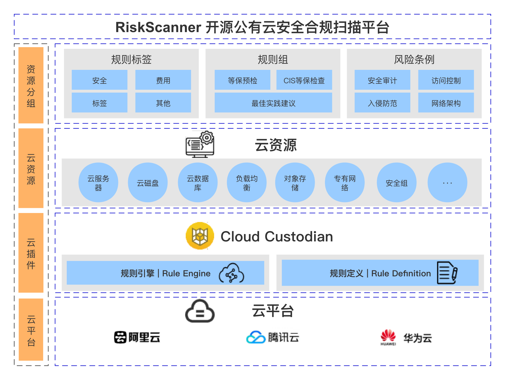
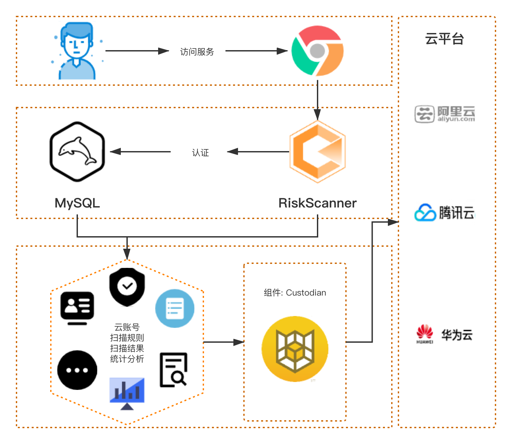

## 整体架构

!!! info "组件说明"
    - Smart R&D: RiskScanner Web 基于 VUE2.6.10 、 Server 基于 SpringBoot 框架进行的开发
    - 安全策略: RiskScanner 以简单的YAML配置文件编写安全策略
    - 多云管理: RiskScanner 对常见公(私)有云平台（如Aliyun，Huawei，Tencent，AWS，Azure，GCP，OpenStack，Vsphere等）进行资源扫描与管理
    - 漏洞扫描: RiskScanner 由安全策略里的过滤器进行资源的漏洞扫描
    - 云账号: RiskScanner 的公有云账号信息的基础配置
    - 扫描规则: RiskScanner 的公有云云平台的资源扫描规则
    - 扫描结果: RiskScanner 针对公有云云账号下资源的统一扫描回归数据
    - 统计分析: RiskScanner 针对公有云已有的扫描结果进行统一的数据分析与展示
    - Cloud-Custodian: RiskScanner 的核心组件，扫描云平台资源的规则引擎
    - 云平台插件: Custodian 与公有云平台 SDK 对接的适配器
    - 数据库: RiskScanner 的主要数据均存储在 MySQL
    - 其他组件: 用于处理 RiskScanner 的资源数据
    - Docker Engine: 各组件都是以 Docker 容器运行在节点计算机
  
!!! info "组件关系"

