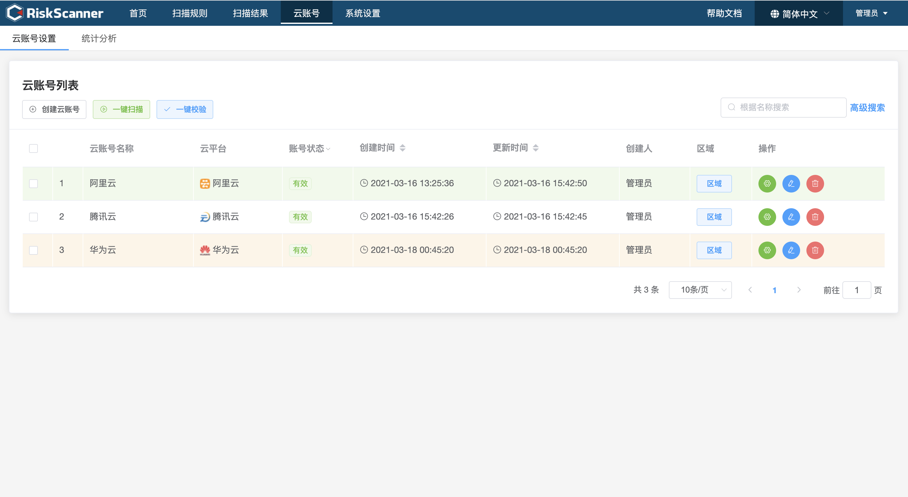
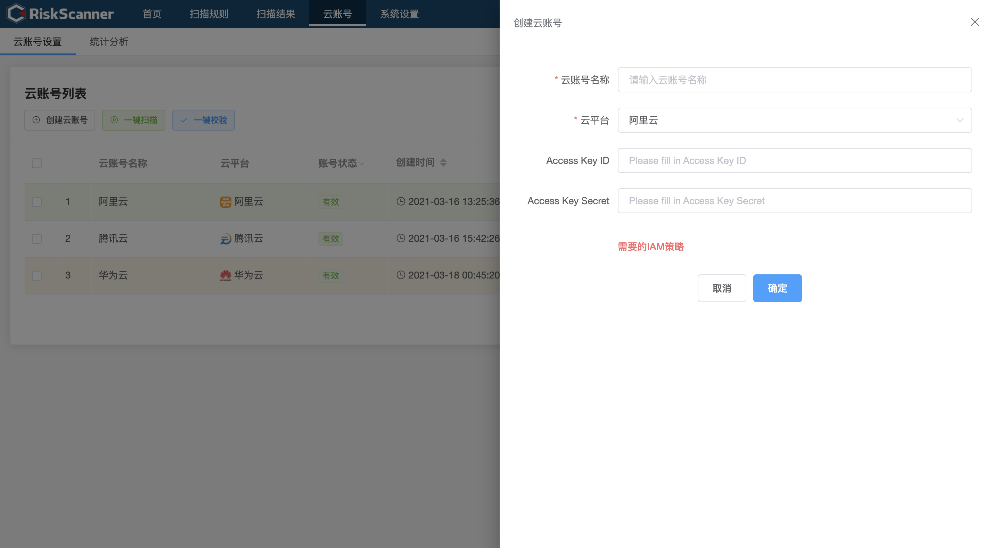
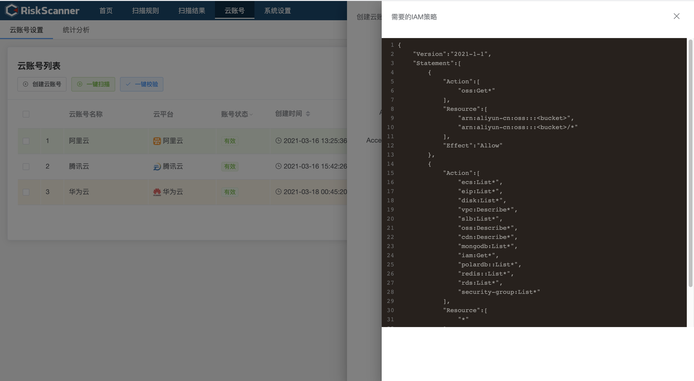
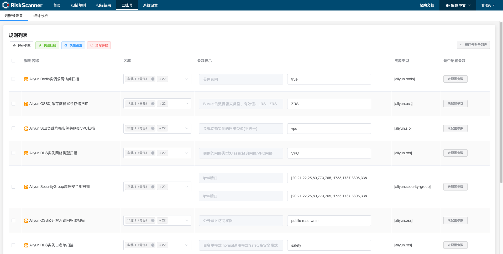
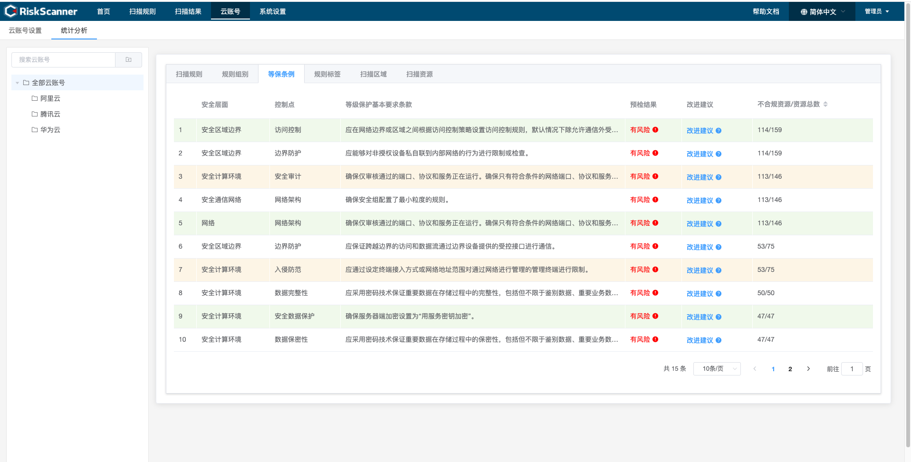
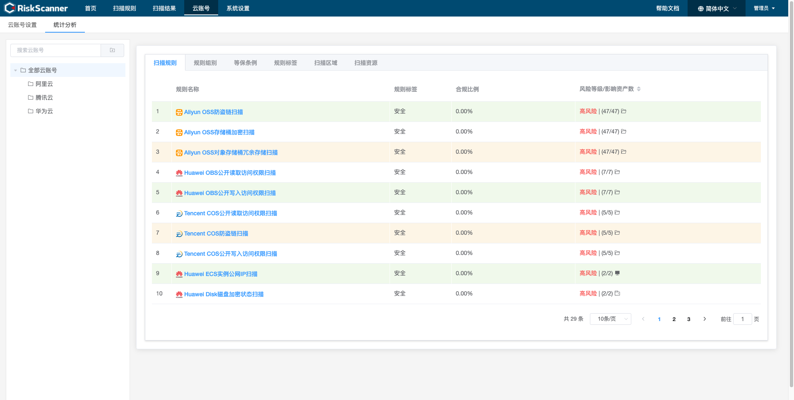
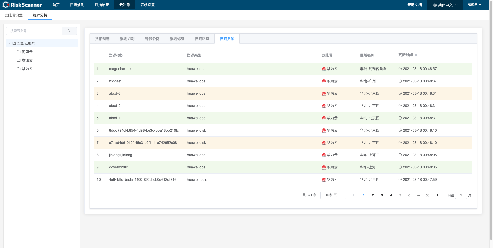

>云账号设置，主要用来记录云账号认证信息，保存扫描参数，用于按扫描规则扫描云平台资源。

### 云账号设置

>云账号列表页面提供了对云账号的创建、删除、编辑、查找、校验、扫描、调参等操作。

>新增/编辑云账号信息。

>查看云平台对应的 IAM 策略信息。

>云账号调参列表页面，提供了对当前云账号的规则则信息参数的保存、清除等操作，以及针对现有参数的快速扫描操作。

### 统计分析

>统计分析页面根据云账号，展示不同维度的扫描结果信息，包括扫描规则、规则组别、等保条例、规则标签、扫描区域、扫描资源等维度展示数据。

