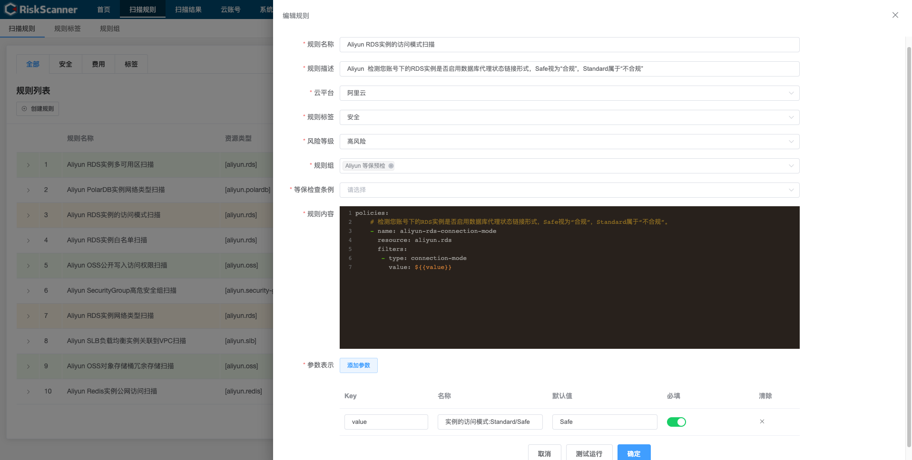
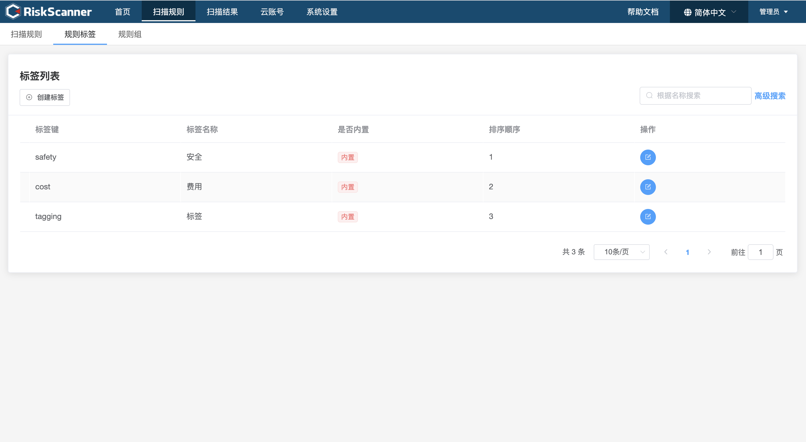

> 规则是 RiskScanner 针对云平台进行资源扫描的基础，它定义了需要扫描与过滤的基本内容。规则标签、规则组、等保条例等是从不同维度针对扫描规则的统计划分。

#### 注：内置扫描规则只有添加对应的云账号后才自动显示。

### 扫描规则

> 扫描规则页面提供了对规则的创建、关闭、删除、编辑、查找等操作。RiskScanner 系统初始化时会默认创建规则，用户也可以根据自己的需要手动创建规则，但是要注意规则内容符合 Yaml 格式规范。

> 新增/编辑扫描规则。

### 规则标签

> 规则标签页面提供了对规则标签的创建、删除、编辑、查找等操作。RiskScanner 系统初始化时会默认创建 3 个内置的规则标签，用户也可以根据自己的需要手动创建规则标签。

### 规则组

> 规则组页面提供了对规则组的创建、删除、编辑、查找等操作。RiskScanner 系统初始化时会默认创建内置的对应云平台的规则组，用户也可以根据自己的需要手动创建规则组。

