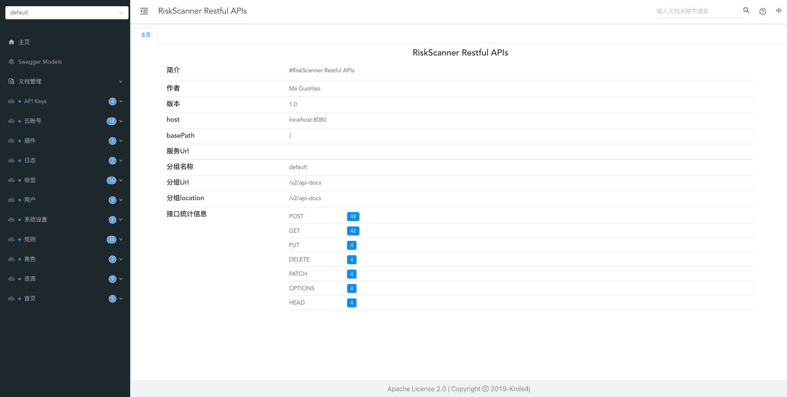

### 用户

>用户列表页面提供了对系统用户的创建、关闭、删除、编辑、查找、密码修改等操作。

### 系统参数设置

>系统参数设置页面提供了对邮件服务的设置，以支持 RiskScanner 平台的邮件服务。

## 个人信息

### 个人设置

>个人设置页面提供了对当前系统用户的编辑、密码修改等操作。

### API Keys

>API Keys 页面提供了对 Access Key 与 Secret Key 的创建、关闭、删除、复制等操作。

